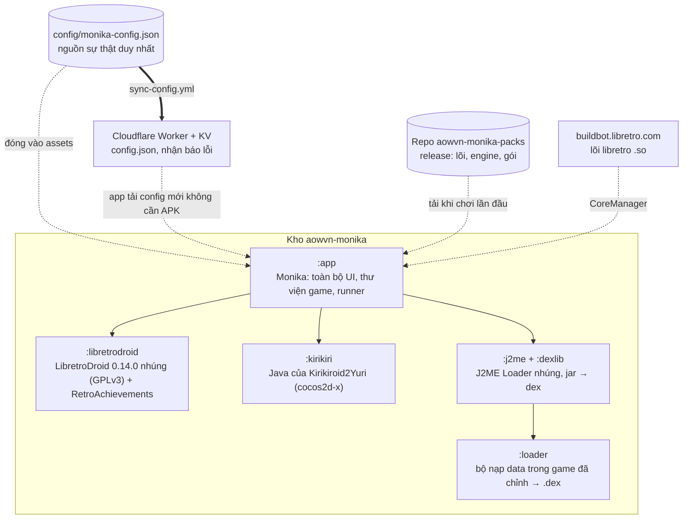
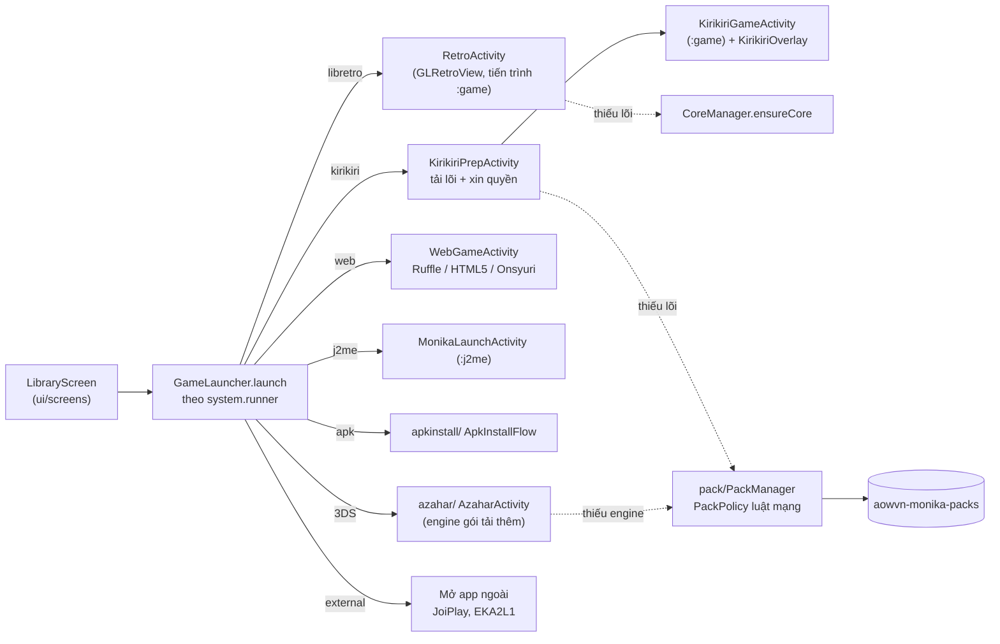
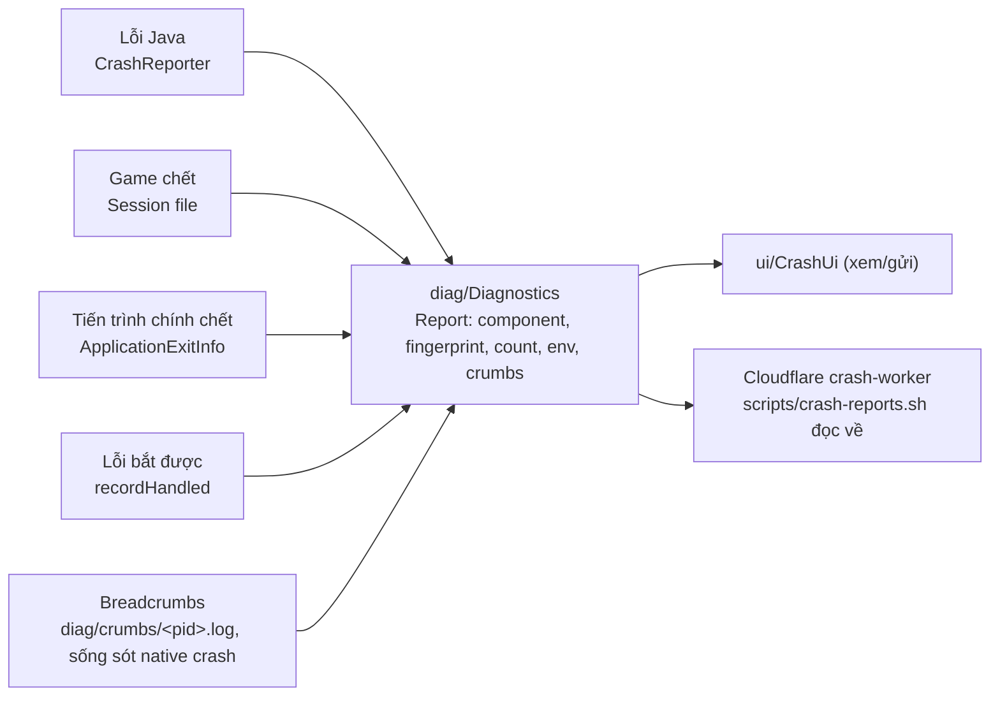

# Giao tiếp với Opus

> **Mục đích.** Tài liệu bàn giao để **Opus tham gia từ bên ngoài** (không cần đổi model của phiên đang làm) đọc là hiểu dự án, rồi **đưa phương án** cho các câu hỏi ở mục 7. Người thi công hiện tại là Claude Code (Sonnet); chủ repo ("sếp") quyết định cuối cùng.
> Cập nhật: 03/10/2026 (GMT+7), bản app 0.7.2 (versionCode 37), `configVersion` 30. Chỗ ghi **[CHƯA KIỂM]** = chưa thử trên máy thật, đừng coi là chạy được.
> Đọc kèm: `CLAUDE.md` (luật bắt buộc), `docs/KIEN-TRUC.md` (tự sinh), `docs/KIEN-TRUC-tay.md` (luồng + "sửa X mở file nào").

## 1. Dự án là gì
Aow Monika: app Android (Kotlin, Jetpack Compose) của blog aow.vn. Đọc bài (Blogger feed), thông báo bài mới, **tải, giải nén và chơi game** (giả lập + engine nhúng), cài game Android (APK/OBB), vá Việt hóa ROM, dịch màn hình, thành tựu RetroAchievements. Giao diện/tài liệu/chuỗi hiển thị bằng **tiếng Việt**.

### Luật cứng (vi phạm là sai hướng)
| Luật | Ý nghĩa |
|---|---|
| Config-first | Link, lõi, hệ máy, gói tải thêm nằm ở `config/monika-config.json`, không hard-code. Sửa config phải tăng `configVersion`. |
| App nhẹ nhất | Thành phần nặng (engine, lõi, 7-Zip native, Kirikiri, Azahar…) **không đóng trong APK**, tải khi dùng lần đầu qua `pack/`. |
| Luật mạng khi tải | Wi-Fi: tải ngay. ≤ 15 MB: tự tải kể cả 4G. Lớn hơn: hỏi "Tải luôn bằng 4G" / "Đợi Wi-Fi". |
| 1 APK mỗi bản | Mỗi phiên bản chỉ phát hành **một APK universal**. |
| DI thủ công | Mọi thành phần tạo ở `AppGraph.kt`; không thêm Hilt/Koin. |
| Phiên bản thư viện | Chỉ sửa ở `gradle/libs.versions.toml` (ngoại lệ: `j2me`, `kirikiri` giữ build.gradle Groovy riêng). |
| Giao diện | Chỉ dùng token/thành phần trong `ui/theme/` (Monika.colors/type/motion, Radius…). |
| Bí mật | Không commit/in keystore, mật khẩu, token. Cách ký/phát hành: `CLAUDE.md` mục "Phát hành APK". |
| Chạy thật | Chưa có máy thật trong phiên → luôn ghi rõ cái gì mới chỉ build + test. |

## 2. Sơ đồ cấu trúc

### 2.1 Module Gradle và nguồn bên ngoài

### 2.2 Luồng "bấm game là chơi"

### 2.3 Báo lỗi (diag)

## 3. Vai trò từng thư mục

### 3.1 Gốc repo
| Thư mục / file | Vai trò |
|---|---|
| `app/` | Module ứng dụng (Kotlin). Chi tiết 3.2. |
| `config/` | `monika-config.json`: hệ máy, lõi, app ngoài, `modules` (gói tải thêm), host tải, mật khẩu nén, prefetch… Gradle đóng chính file này vào assets. |
| `docs/` | Tài liệu: kiến trúc (tự sinh + viết tay), các `plan-*.md`, hướng dẫn quản trị, test máy thật/cloud. |
| `scripts/` | Công cụ: `gen-architecture.py` (sinh `KIEN-TRUC.md`), `audit-cores.py` (kiểm lõi/tùy chọn), `ci-emulator-games.sh` (kiểm trong máy ảo), `crash-reports.sh`, `pixeldrain-upload.sh`, `check-r8-mapping.py`, `cheats-index.py`. |
| `.github/workflows/` | `build.yml` (build + test), `release.yml` (ký + phát hành), `emulator-test.yml` (máy ảo API 30/34), `test-lab.yml`, `native-check.yml`, `build-engines.yml` (Azahar…), `build-kirikiri.yml` (dựng Kirikiri từ nguồn + đóng gói), `publish-pack.yml`/`mirror-pack.yml` (đưa gói lên repo packs), `sync-config.yml` (đẩy config lên Cloudflare). |
| `cloudflare/` | `worker.js` (phát config từ KV), `crash-worker/` (nhận báo lỗi). |
| `kirikiri/` | Module Android library: Java của Kirikiroid2Yuri. `patches/` (3 bản vá áp lên nguồn gốc khi build), `overlay/assets/locale/vi_vn.xml` (menu tiếng Việt), `reference/en_us.xml` (bản gốc để đối chiếu id), `src/` (Java, AIDL, stub). Lib native **không** nằm ở đây mà ở gói tải thêm. |
| `libretrodroid/` | LibretroDroid nhúng (GPLv3) để thêm RetroAchievements. Xem `docs/LIBRETRODROID.md`. |
| `j2me/`, `dexlib/`, `loader/` | Game Java: J2ME Loader nhúng (Apache-2.0), dx chuyển jar → dex, bộ nạp data. Xem `docs/J2ME-LOADER.md`. |
| `packs/sevenzip/` | Nguồn dựng gói 7-Zip native (tải khi gặp rar/7z). |
| `tools/`, `gradle/`, `build/` | Công cụ phụ; catalog phiên bản `libs.versions.toml`; đầu ra build (không commit). |

### 3.2 `app/src/main/java/vn/aow/monika/` (mỗi thư mục = một thành phần)
| Package | Vai trò |
|---|---|
| (gốc) | `AppGraph` (cắm mọi thứ), `Prefs`, `MonikaApp`, `CrashReporter`. Dự kiến thành `:core`. |
| `ui/` | `MainActivity`, `screens/` (Thư viện, Trình chạy, Cài đặt…), `theme/` (token, nút, sheet, FloatingDock, icon), `CrashUi`, `AppMenu`. |
| `runner/` | Mở và chạy game: `GameLauncher` (định tuyến theo runner), `RetroActivity` + `GamePadOverlay`, `CoreManager`, `CoreOptions`, `EmuTier`, `WebGameActivity`, `Kirikiri*Activity`/`KirikiriOverlay`, `PlayClock`. |
| `library/` | Thư viện game: quét, nhập, giải nén (zip4j / 7-Zip native / 7z thuần Java), nhận diện ROM, ảnh bìa, save vault, `PrefetchPlanner` (đoán gói cần). |
| `pack/` | Gói tải thêm: `PackManager` (cài, `ready()`), `PackPolicy` (luật mạng), `SimpleModule` (tải → SHA-256 → giải nén vào `filesDir/packs/<id>`). |
| `config/` | `MonikaConfig` (mô hình, mọi trường mới có mặc định) + `ConfigRepository` (tải/ưu tiên theo `configVersion`). |
| `azahar/` | Engine 3DS (Azahar) chạy trong app, gói tải thêm. |
| `apkinstall/` | Cài APK/APKS/XAPK/OBB/data, ADB, repack, kiểm sức khỏe sau cài. |
| `achievements/` | RetroAchievements: tài khoản, băm ROM, thành tựu, bảng thành tựu trong game. |
| `cheats/` | Cheat cho libretro và web. |
| `browser/`, `download/` | Trình duyệt trong app (chặn quảng cáo), tải file (Pixeldrain…), hộp thoại tải. |
| `translate/` | Dịch màn hình (ML Kit, bộ nhớ dịch). Đang đóng trong APK; kế hoạch tách ở `docs/plan-dich-offline.md`. |
| `patch/` | Vá Việt hóa ROM IPS/BPS/UPS. |
| `feed/`, `notify/`, `forum/`, `community/`, `account/` | Đọc bài Blogger, thông báo (WorkManager), diễn đàn, cộng đồng, tài khoản aow.vn. |
| `diag/` | Bắt và gộp crash log theo thành phần (xem 2.3, `CLAUDE.md`). |

## 4. Đã làm được gì (trạng thái)

| Nhóm | Trạng thái | Mức xác minh |
|---|---|---|
| Đọc bài + thông báo | Xong | Build + test |
| Giả lập libretro (NES→PSP, 3DS bằng Azahar, Dreamcast…) 20+ hệ trong config | Xong | Build + test + Emulator Test (máy ảo) |
| Thư viện, nhập game, giải nén zip/rar/rar5/7z, nhiều phần, mật khẩu | Xong | Unit test; **[CHƯA KIỂM]** máy thật |
| Tay cầm ảo, 3 ô save, tùy chọn lõi, kiểu hiển thị, cheat | Xong | Unit/UI test; **[CHƯA KIỂM]** máy thật |
| Game Java (J2ME Loader nhúng) | Xong | Build; **[CHƯA KIỂM]** máy thật |
| Cài APK/OBB/data + ADB | Xong | Test + giả lập; **[CHƯA KIỂM]** nhiều máy thật |
| Vá Việt hóa IPS/BPS/UPS | Xong | Unit test. Chưa có xdelta/PPF/APS |
| Gói tải thêm + luật mạng + tải trước thông minh | Xong | Unit test + Emulator Test |
| RetroAchievements (đăng nhập, hardcore, thành tựu trong game) | Xong phần app | **[CHƯA KIỂM]** trong game thật; cần RAdmin duyệt client "AowMonika" cho hardcore |
| Crash log theo thành phần (dedup, env, crumbs, ApplicationExitInfo) | Xong | Unit test |
| Kirikiri (visual novel .xp3) nhúng trong Monika | Lõi dựng từ nguồn, lib nạp từ gói trong máy ảo không sập (API 30/34) | **[CHƯA KIỂM]** chơi game thật, âm thanh, chạm, lưu, tua nhanh |
| Kirikiri tích hợp sâu (commit 92a65b2): màn chuẩn bị tự tải, menu Monika, Việt hóa 119 chuỗi | Mã xong, test xanh | Gói có bản dịch **đang dựng lại**; sau đó cập nhật `modules.kirikiri` + Emulator Test + phát hành 0.7.3 |
| ONScripter (web, Onsyuri), Ruffle, HTML5 | Có runner | **[CHƯA KIỂM]** máy thật |
| Ren'Py, RPG Maker XP/VX/Ace, Symbian | Vẫn dùng app ngoài (JoiPlay, EKA2L1) | Chưa nhúng |

## 5. Chưa làm / việc đang chờ
1. Test máy thật cho toàn bộ (chủ repo làm).
2. Chủ repo nhắn RAdmin duyệt client "AowMonika" cho hardcore.
3. Dịch offline: tách ML Kit khỏi APK (spike ở `docs/plan-dich-offline.md`).
4. Tách module `:theme` và `:core` để cắt vòng phụ thuộc `ui ⇄ runner/azahar/browser…` (`docs/KIEN-TRUC-tay.md` mục A).
5. RetroAchievements cho NDS/N64/PS1 (cần cách băm riêng).
6. xdelta/PPF cho vá Việt hóa; ISO > 256 MB.
7. Nhúng sâu Ren'Py, RPG Maker XP/VX/Ace (`docs/plan-engine-moi.md`), Symbian.
8. Kirikiri chỉ có **arm64-v8a** (nguồn Yuri chỉ dựng cho chip này).

## 6. Cách làm việc và cách đưa phương án (giao thức cho Opus)

**Opus được làm:** đọc repo/tài liệu, phản biện thiết kế, đề xuất phương án, viết đặc tả hoặc đoạn mã mẫu để Sonnet thi công.
**Opus không làm (trừ khi sếp bảo):** sửa thẳng `main`, phát hành, chạm bí mật/khóa ký.

**Cách trả lời** (để Sonnet làm theo mà không phải đoán): với mỗi câu hỏi ở mục 7, ghi
1. **Kết luận** một dòng (chọn phương án nào).
2. **Lý do** + đánh đổi (dung lượng APK, rủi ro, công sức).
3. **Các bước thi công** theo thứ tự, mỗi bước có cách kiểm; file/package đụng tới.
4. **Điều chưa chắc** (đánh **[CHƯA KIỂM]**), không đoán số liệu.

Đặt phương án vào `docs/opus/<ngày>-<chủ đề>.md` (thư mục tạo khi cần) hoặc dán vào cuộc trò chuyện; Sonnet sẽ thi công và ghi kết quả vào mục 4 của tài liệu này.

## 7. Câu hỏi đang cần phương án
1. **Tách module** `:theme` / `:core`: thứ tự cắt tối thiểu rủi ro? Có đáng làm trước khi thêm engine mới?
2. **Dịch offline**: mô hình nào cân bằng chất lượng/dung lượng, và tải theo nhu cầu thế nào để APK không chứa gì (`docs/plan-dich-offline.md`)?
3. **Kirikiri trên máy ARM 32-bit** (armeabi-v7a): có đường nào ngoài tự dựng từ nguồn Yuri không?
4. **RetroAchievements** cho NDS/N64/PS1: băm ROM và nhận diện đúng mà không phình APK?
5. **Nhúng sâu Ren'Py và RPG Maker XP/VX/Ace**: nên theo mô hình Kirikiri (module Java + gói native tải thêm) hay hướng khác?
6. **Kiểm thử không có máy thật**: bổ sung gì ở Emulator Test để bắt được lỗi chạm/âm thanh/lưu của Kirikiri?
7. **Chất lượng crash log**: còn thiếu tín hiệu nào để chẩn đoán từ xa mà không cần máy thật?
