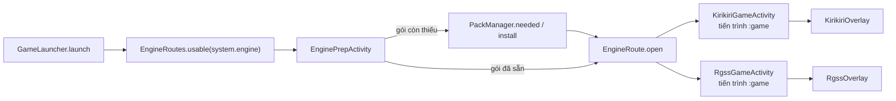

# Hướng dẫn đọc nhanh (viết tay — cập nhật khi đổi luồng)

## A. Nhìn nhanh phụ thuộc
- Gần như mọi package "phụ thuộc `ui`" thực chất chỉ dùng **`ui.theme`** (bộ giao diện chung: nút, sheet, màu, icon). Đây là chỗ cắt rẻ nhất: tách `ui.theme` thành module riêng `:theme` thì các vòng `runner/azahar/browser/cheats/apkinstall ⇄ ui` biến mất (kiểm bằng cách chạy lại `scripts/gen-architecture.py`, mục 4).
- `(gốc)` = `AppGraph`, `Prefs`, `MonikaApp`, `CrashReporter`: nơi mọi thứ cắm vào nhau. Khi tách module thì đây là `:core`.
- `library` ⇄ `ui` (3 / 20): thẻ game và màn hình Thư viện; chấp nhận được, `ui` là tầng trên cùng.

## B. Luồng chính (đi theo file)
1. **Mở game**: `ui/screens/LibraryScreen` → `runner/GameLauncher.launch` chọn theo `system.runner` trong config:
   - `libretro` → `RetroActivity` (tiến trình `:game`), riêng 3DS có engine `azahar/`.
   - `web` → `WebGameActivity` · `apk` → `apkinstall/ApkInstallFlow` · `j2me` → `:j2me` (`J2meRuntime.openGameIntent` → `MonikaLaunchActivity`) · `external` → app ngoài.
2. **Lõi libretro**: `runner/CoreManager.ensureCore` tải `.so` theo config (ABI lấy theo thư viện native của app) → `RetroActivity` dựng `GLRetroView`.
   Tùy chọn lõi gộp theo thứ tự: config → mức máy (`EmuTier`: lite/mid/full) → kiểu hiển thị → lựa chọn của người chơi.
3. **Config trước tiên**: `config/monika-config.json` (hệ máy, lõi, link, tùy chọn). Sửa file + push `main` là app cập nhật, không cần APK. Kiểm lõi/tùy chọn: `python3 scripts/audit-cores.py`.
4. **Lỗi/crash**: `diag/Diagnostics` (phiên chơi → báo cáo) · `RetroActivity.onCoreFailure` (lõi báo lỗi/không lên hình → hỏi đổi lõi) · `ui/CrashUi` (hộp thoại) · gửi về máy chủ báo lỗi (`crash.endpoint`, xem `scripts/crash-reports.sh`).
5. **Phát hành**: Actions → Release (`workflow_dispatch`, nhập tag) → build ký → GitHub Release + Pixeldrain. Kiểm giả lập trên máy ảo: workflow Emulator Test.

### B.1 Engine nhúng (Kirikiri, RPG Maker)

`EnginePrepActivity` kiểm tra quyền đọc game và trạng thái gói; gói chưa có thì tải qua `PackManager`, xong mới mở Activity của engine. Hai Activity chạy trong tiến trình `:game`, khai báo ở `app/src/main/AndroidManifest.xml`; mỗi Activity hiển thị lớp phủ riêng.

| Muốn sửa | Mở file |
|---|---|
| Chọn engine theo cấu hình và đăng ký route | `app/src/main/java/vn/aow/monika/runner/GameLauncher.kt`, `app/src/main/java/vn/aow/monika/runner/EngineRoutes.kt` |
| Màn chuẩn bị, quyền đọc game, tải gói trước khi mở | `app/src/main/java/vn/aow/monika/runner/EnginePrepActivity.kt` |
| Khai báo URL/kích thước gói hoặc thay đổi installer | `config/monika-config.json`, `app/src/main/java/vn/aow/monika/pack/PackManager.kt` |
| Mở game Kirikiri hoặc sửa lớp phủ Kirikiri | `app/src/main/java/vn/aow/monika/runner/KirikiriGameActivity.kt`, `app/src/main/java/vn/aow/monika/runner/KirikiriOverlay.kt` |
| Mở game RPG Maker hoặc sửa lớp phủ RPG Maker | `app/src/main/java/vn/aow/monika/runner/RgssGameActivity.kt`, `app/src/main/java/vn/aow/monika/runner/RgssOverlay.kt` |
| Đổi tiến trình của Activity game | `app/src/main/AndroidManifest.xml` |

## C. Muốn sửa X thì mở file nào
| Việc | Nơi sửa |
|---|---|
| Thêm/đổi lõi, tùy chọn hiệu năng, hệ máy | `config/monika-config.json` (+ chạy `audit-cores.py`) |
| Kiểu hiển thị GBA (LCD/Sắc nét/Mượt) | `runner/DisplayStyles.kt` + khối `display` của lõi trong config |
| Hiệu năng theo sức máy | `runner/EmuTier.kt` + `perf` trong config |
| Giao diện tay cầm trong game | `runner/GamePadOverlay.kt` |
| Game Java | `:j2me` (xem `docs/J2ME-LOADER.md`) |
| Cài game Android (APK/OBB/ADB) | `apkinstall/` |
| Trình duyệt, tải file | `browser/`, `download/` |
| Thư viện game, tìm kiếm | `library/`, `ui/screens/LibraryScreen.kt` |
| Màu, nút, sheet chung | `ui/theme/` |

## D. Quy ước để việc sửa gọn và chẩn đoán lỗi nhanh
- Mỗi thư mục trong `vn/aow/monika/` là **một thành phần**; code ở thành phần này không gọi thẳng nội bộ thành phần khác ngoài API công khai của nó.
- Log/báo lỗi gắn nhãn thành phần theo tên thư mục (`runner`, `apkinstall`, `browser`, `j2me`…). Tag log của game: `MonikaGame`.
- Thêm thành phần mới → tạo thư mục mới, chạy lại `python3 scripts/gen-architecture.py`, commit cả `docs/KIEN-TRUC.md`.
