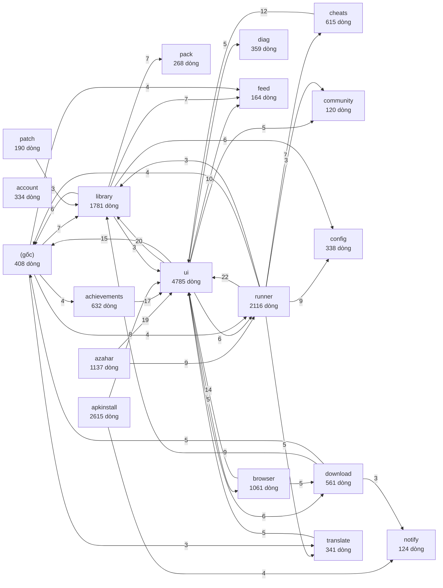

# Kiến trúc Aow Monika (tự sinh — đừng sửa tay)

> Sinh bởi `scripts/gen-architecture.py` từ mã nguồn. Phần luồng chính / nơi sửa gì: xem `docs/KIEN-TRUC-tay.md` (viết tay, cuối tệp này).

## 1. Module Gradle

| Module | Vai trò |
|---|---|
| `:app` | Ứng dụng Monika (toàn bộ mã Kotlin bên dưới) |
| `:j2me` | Lõi game Java: JL-Mod nhúng + chỉnh sửa Monika (xem `docs/J2ME-LOADER.md`) |
| `:dexlib` | dx của AOSP: chuyển .jar → .dex cho game Java |
| `:loader` | Bộ nạp data chạy trong game đã chỉnh (Java thuần → .dex nhúng vào assets) |

## 2. Package trong `:app`

| Package | File | Dòng | Phụ thuộc vào (số tham chiếu) | Được dùng bởi |
|---|---:|---:|---|---|
| `ui` | 22 | 4785 | library(20), (gốc)(15), feed(10), runner(6), download(6), diag(5) | runner(22), azahar(19), achievements(17), browser(14), cheats(12), apkinstall(8) |
| `apkinstall` | 27 | 2615 | ui(8), notify(4), library(1) | runner(2), translate(2), achievements(2), ui(1), download(1) |
| `runner` | 11 | 2116 | ui(22), config(9), cheats(7), translate(5), (gốc)(4), community(3) | azahar(9), ui(6), (gốc)(4), download(2) |
| `library` | 20 | 1781 | feed(7), pack(7), config(6), (gốc)(6), ui(3), notify(2) | ui(20), download(9), (gốc)(7), runner(3), patch(3), cheats(2) |
| `azahar` | 7 | 1137 | ui(19), runner(9), diag(2), (gốc)(2), community(1), config(1) | ui(2), runner(2), (gốc)(1), pack(1) |
| `browser` | 5 | 1061 | ui(14), download(5), (gốc)(1) | ui(5), community(2), (gốc)(1), account(1), achievements(1) |
| `achievements` | 8 | 632 | ui(17), apkinstall(2), (gốc)(2), browser(1), library(1) | (gốc)(4), ui(2) |
| `cheats` | 7 | 615 | ui(12), library(2), (gốc)(1) | runner(7) |
| `download` | 5 | 561 | library(9), (gốc)(5), notify(3), runner(2), config(1), ui(1) | ui(6), browser(5), (gốc)(2) |
| `(gốc)` | 4 | 408 | library(7), runner(4), feed(4), achievements(4), translate(3), notify(2) | ui(15), library(6), download(5), runner(4), azahar(2), achievements(2) |
| `diag` | 1 | 359 | (gốc)(1) | ui(5), azahar(2), (gốc)(1), runner(1), pack(1) |
| `translate` | 6 | 341 | ui(5), apkinstall(2) | runner(5), (gốc)(3) |
| `config` | 2 | 338 | — | runner(9), library(6), ui(2), account(2), pack(2), (gốc)(1) |
| `account` | 3 | 334 | config(2), browser(1), ui(1), (gốc)(1) | (gốc)(2), ui(2) |
| `pack` | 3 | 268 | config(2), notify(1), library(1), diag(1), (gốc)(1), azahar(1) | library(7), runner(2), (gốc)(1) |
| `patch` | 2 | 190 | library(3) | ui(1) |
| `feed` | 2 | 164 | config(1) | ui(10), library(7), (gốc)(4), notify(1) |
| `notify` | 2 | 124 | feed(1), ui(1), (gốc)(1) | apkinstall(4), download(3), (gốc)(2), library(2), pack(1) |
| `community` | 2 | 120 | browser(2), (gốc)(1) | ui(5), runner(3), azahar(1) |

## 3. Sơ đồ phụ thuộc (mũi tên = "gọi tới"; chỉ vẽ cạnh ≥ 3 tham chiếu)

## 4. Phụ thuộc hai chiều (ứng viên phải gỡ trước khi tách module)

- `(gốc)` ⇄ `account` (2 / 1)
- `(gốc)` ⇄ `achievements` (4 / 2)
- `(gốc)` ⇄ `azahar` (1 / 2)
- `(gốc)` ⇄ `browser` (1 / 1)
- `(gốc)` ⇄ `diag` (1 / 1)
- `(gốc)` ⇄ `download` (2 / 5)
- `(gốc)` ⇄ `library` (7 / 6)
- `(gốc)` ⇄ `notify` (2 / 1)
- `(gốc)` ⇄ `pack` (1 / 1)
- `(gốc)` ⇄ `runner` (4 / 4)
- `account` ⇄ `ui` (1 / 2)
- `achievements` ⇄ `ui` (17 / 2)
- `apkinstall` ⇄ `ui` (8 / 1)
- `azahar` ⇄ `runner` (9 / 2)
- `azahar` ⇄ `ui` (19 / 2)
- `browser` ⇄ `ui` (14 / 5)
- `download` ⇄ `ui` (1 / 6)
- `library` ⇄ `pack` (7 / 1)
- `library` ⇄ `ui` (3 / 20)
- `runner` ⇄ `ui` (22 / 6)

## 5. File lớn nhất (ứng viên tách nhỏ)

| File | Dòng |
|---|---:|
| `app/src/main/java/vn/aow/monika/ui/screens/LibraryScreen.kt` | 668 |
| `app/src/main/java/vn/aow/monika/runner/GamePadOverlay.kt` | 634 |
| `app/src/main/java/vn/aow/monika/runner/RetroActivity.kt` | 548 |
| `app/src/main/java/vn/aow/monika/azahar/AzaharActivity.kt` | 448 |
| `app/src/main/java/vn/aow/monika/browser/InAppBrowserActivity.kt` | 447 |
| `app/src/main/java/vn/aow/monika/ui/screens/SettingsScreen.kt` | 440 |
| `app/src/main/java/vn/aow/monika/diag/Diagnostics.kt` | 359 |
| `app/src/main/java/vn/aow/monika/ui/theme/Components.kt` | 340 |
| `app/src/main/java/vn/aow/monika/library/GameInfoResolver.kt` | 329 |
| `app/src/main/java/vn/aow/monika/ui/screens/PostScreen.kt` | 327 |
| `app/src/main/java/vn/aow/monika/ui/screens/DownloadsScreen.kt` | 316 |
| `app/src/main/java/vn/aow/monika/apkinstall/ApkInstallFlow.kt` | 312 |

## 6. Điểm vào (AndroidManifest)

- activity `.ui.MainActivity`
- activity `.runner.RetroActivity`
- activity `.azahar.AzaharActivity`
- activity `.azahar.AzaharInstallActivity`
- activity `.runner.WebGameActivity`
- activity `.CrashActivity`
- activity `.account.AuthCallbackActivity`
- activity `.browser.InAppBrowserActivity`
- activity `.apkinstall.ApkInstallActivity`
- receiver `.apkinstall.InstallResultReceiver`
- receiver `.apkinstall.adb.AdbPairing$AdbPairReceiver`
- provider `.apkinstall.LoaderBusProvider`
- provider `.apkinstall.GameDataProvider`
- receiver `.pack.PackChoiceReceiver`
- receiver `.download.DownloadReceiver`
- service `androidx.work.impl.foreground.SystemForegroundService`
- service `.runner.GameWarmService`
- service `.download.BrowserDownloadService`
- provider `androidx.core.content.FileProvider`

---

# Hướng dẫn đọc nhanh (viết tay — cập nhật khi đổi luồng)

## A. Nhìn nhanh phụ thuộc
- Gần như mọi package "phụ thuộc `ui`" thực chất chỉ dùng **`ui.theme`** (bộ giao diện chung: nút, sheet, màu, icon). Đây là chỗ cắt rẻ nhất: tách `ui.theme` thành module riêng `:theme` thì các vòng `runner/azahar/browser/cheats/apkinstall ⇄ ui` biến mất (kiểm bằng cách chạy lại `scripts/gen-architecture.py`, mục 4).
- `(gốc)` = `AppGraph`, `Prefs`, `MonikaApp`, `CrashReporter`: nơi mọi thứ cắm vào nhau. Khi tách module thì đây là `:core`.
- `library` ⇄ `ui` (3 / 20): thẻ game và màn hình Thư viện; chấp nhận được, `ui` là tầng trên cùng.

## B. Luồng chính (đi theo file)
1. **Mở game**: `ui/screens/LibraryScreen` → `runner/GameLauncher.launch` chọn theo `system.runner` trong config:
   - `libretro` → `RetroActivity` (tiến trình `:game`), riêng 3DS có engine `azahar/`.
   - `web` → `WebGameActivity` · `apk` → `apkinstall/ApkInstallFlow` · `j2me` → `:j2me` (`J2meRuntime.openGameIntent` → `MonikaLaunchActivity`) · `external` → app ngoài.
2. **Lõi libretro**: `runner/CoreManager.ensureCore` tải `.so` theo config (ABI lấy theo thư viện native của app) → `RetroActivity` dựng `GLRetroView`.
   Tùy chọn lõi gộp theo thứ tự: config → mức máy (`EmuTier`: lite/mid/full) → kiểu hiển thị → lựa chọn của người chơi.
3. **Config trước tiên**: `config/monika-config.json` (hệ máy, lõi, link, tùy chọn). Sửa file + push `main` là app cập nhật, không cần APK. Kiểm lõi/tùy chọn: `python3 scripts/audit-cores.py`.
4. **Lỗi/crash**: `diag/Diagnostics` (phiên chơi → báo cáo) · `RetroActivity.onCoreFailure` (lõi báo lỗi/không lên hình → hỏi đổi lõi) · `ui/CrashUi` (hộp thoại) · gửi về máy chủ báo lỗi (`crash.endpoint`, xem `scripts/crash-reports.sh`).
5. **Phát hành**: Actions → Release (`workflow_dispatch`, nhập tag) → build ký → GitHub Release + Pixeldrain. Kiểm giả lập trên máy ảo: workflow Emulator Test.

## C. Muốn sửa X thì mở file nào
| Việc | Nơi sửa |
|---|---|
| Thêm/đổi lõi, tùy chọn hiệu năng, hệ máy | `config/monika-config.json` (+ chạy `audit-cores.py`) |
| Kiểu hiển thị GBA (LCD/Sắc nét/Mượt) | `runner/DisplayStyles.kt` + khối `display` của lõi trong config |
| Hiệu năng theo sức máy | `runner/EmuTier.kt` + `perf` trong config |
| Giao diện tay cầm trong game | `runner/GamePadOverlay.kt` |
| Game Java | `:j2me` (xem `docs/J2ME-LOADER.md`) |
| Cài game Android (APK/OBB/ADB) | `apkinstall/` |
| Trình duyệt, tải file | `browser/`, `download/` |
| Thư viện game, tìm kiếm | `library/`, `ui/screens/LibraryScreen.kt` |
| Màu, nút, sheet chung | `ui/theme/` |

## D. Quy ước để việc sửa gọn và chẩn đoán lỗi nhanh
- Mỗi thư mục trong `vn/aow/monika/` là **một thành phần**; code ở thành phần này không gọi thẳng nội bộ thành phần khác ngoài API công khai của nó.
- Log/báo lỗi gắn nhãn thành phần theo tên thư mục (`runner`, `apkinstall`, `browser`, `j2me`…). Tag log của game: `MonikaGame`.
- Thêm thành phần mới → tạo thư mục mới, chạy lại `python3 scripts/gen-architecture.py`, commit cả `docs/KIEN-TRUC.md`.

